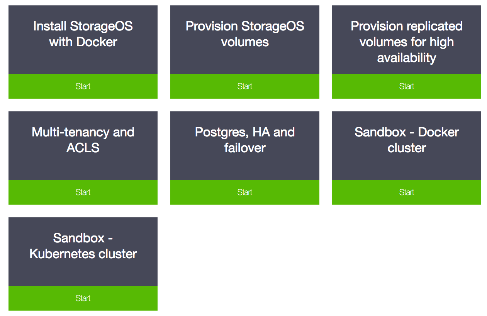

# Interactive tutorials

[Our interactive tutorials](https://play.storageos.com/main) provide you with a
pre-configured StorageOS cluster, accessible from your browser without any
downloads or configuration.

